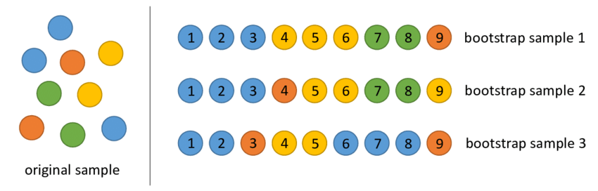
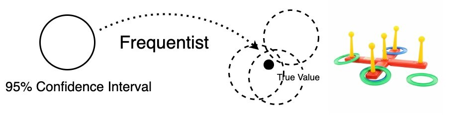
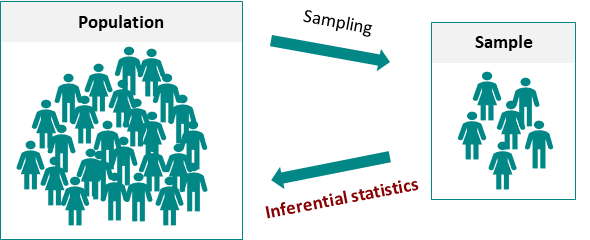
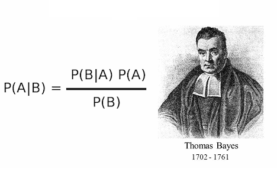
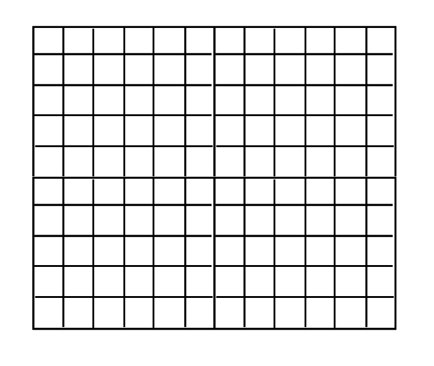

```{r setup, include=FALSE}
knitr::opts_chunk$set(
  echo = FALSE,
  message = FALSE,
  warning = FALSE,
  #fig.width = 6, 
  fig.pos = "center",
  fig.align = "center",
  fig.show = "hold",
  fig.showtext = TRUE,
  dpi = 300
)
knitr::knit_engines$set(stan = cmdstanr::eng_cmdstan)
```


```{r, message=FALSE, warning=FALSE}
library(tidyverse)
library(tidybayes)
library(ggdist)
library(cmdstanr)
check_cmdstan_toolchain(fix = TRUE, quiet = TRUE)
```


---
class: middle, center

# 我们今天讲一个数据故事

---
## 校长交办了一个任务

估算全校同学的平均身高

- 全校普查似乎不现实

- 随机选取200名同学，然后根据这200名同学的身高，推算全校总体的情况


```{r, message=FALSE, warning=FALSE}
raw <- 
  readr::read_rds(here::here('data', "height_weight.rds")) %>% 
  as_tibble() %>% 
  mutate(id = 1:n()) %>% 
  mutate(across(c(height, weight), ~ round(.x, 2)))  
  
d <- raw %>% select(id, height)

d %>% 
  head(9) %>% 
  knitr::kable(
    format = "html", 
    booktabs = TRUE, 
    table.attr = "style='width:40%;'"
  ) %>% 
  kableExtra::kable_styling(
    bootstrap_options = "hover",
    html_font = "Cambria"
  )
```

---


## 不费吹灰之力

很快计算出200个同学的平均身高
```{r}
d %>% 
  summarise(mean_height = round(mean(height), 2)) %>% 
  knitr::kable()
```

<br><br>
马上兴高采烈地报告校长，全校同学的身高均值是164.89。

---
## 如果您是校长，您对结果满意？

应该不满意

```{r, out.width='40%', fig.align='center', echo = F}

```

- 因为这200个学生，相对全校而言，是一个很小的样本，难免以偏概全。
- 这个164.89可靠性有多高，不确定性是多少？


---
## 我努力改进

你看到校长脸色有些不好看，弱弱地说：“要不我重新再找200个学生，再做一次，或者再找第三组的200个学生，然后第四组，这样重复很多次”。

--

```{r, out.width='75%', fig.align='center', echo = F}

```


---
## 给我一个范围，今天就要

还没等解释完，校长就打断了你的话，“时间来不及了，再说，这又不是做核酸，那有那么多的人力物力，你就用200个同学的身高值，给我估算一个吧，给个范围也行”

--

```{r, out.width='35%', fig.align='center', echo = F}

```

<br>

<span style="text-align:center; font-size:16pt; color:red">
这下有点头疼了，只有一个样本，还要给出范围，那怎么办呢？
</span>


---
class: middle, center

# 一、bootstrap resampling


---
## bootstrap resampling

搞统计的人发明了一个很不错的方法[Bootstrapping](http://en.wikipedia.org/wiki/Bootstrapping)，**有放回的重复抽样**，举个通俗的例子：

```{r, out.width='75%', fig.align='center', echo = F}

```

- 假定这里有一个口袋，里面装着200个球，你摸一个出来，记录下这个球的重量，然后放回去，搅拌一下，再摸一个出来，称下重量，再放回去，如此往复，记录到200个值后，就停下来，这200个值称之为第一个重抽样样本，然后计算下**均值**。ok，第一个样本的工作完成。
- 然后第二个样本，
- 第三个样本...
- 直到1000个重抽样样本，也就得到了1000个均值
- 最后看看这1000个均值的分布


---
## 思维导图

```{r, out.width='65%', fig.align='center', echo = F}

```


---
## 道理明白了，马上开干

```{r, echo=TRUE}
bootstrap_once <- function(df) {

  boot_idx <- sample(1:nrow(df), replace = TRUE)
  
  df <- df %>% slice(boot_idx)
  
  return(df)
}

bootstrap_repeat <- function(df, reps = 30){
  df_out <- 
    purrr::map_dfr(.x = 1:reps, .f = ~ bootstrap_once(df)) %>% 
    dplyr::mutate(replicate = rep(1:reps, each = nrow(df))) %>% 
    dplyr::group_by(replicate)
  
  return(df_out)
}

```

---
## bootstrap resampling

很快得到了1000个均值

.pull-left[
```{r}
df_bootstrap <- d %>% 
  bootstrap_repeat(reps = 1000) %>% 
  group_by(replicate) %>% 
  summarise(mean_height = mean(height)) 

df_bootstrap %>% 
  head(10) %>% 
  knitr::kable(
    format = "html", 
    booktabs = TRUE, 
    table.attr = "style='width:40%;'"
  ) %>% 
  kableExtra::kable_styling()
```
]


.pull-right[

画出了直方图
```{r, out.width = "50%", fig.align='left'}
df_bootstrap %>% 
  ggplot(aes(x = mean_height)) +
  geom_histogram(bins = 15, color = "white") +
  ggtitle("Bootstrap sampling distribution") +
  theme_gray(base_size = 14)
```


给出置信区间
```{r}
ci <- df_bootstrap %>% 
  ggdist::mean_qi(mean_height) %>% 
  mutate(
    across(where(is.numeric), ~round(.x, 2))
  )
ci %>% 
  knitr::kable()
```

]


---
## 95%的置信区间

图中黑色圆点，它代表着全校同学的平均身高，它是客观存在的，并且有一个确定的值（只是我们不知道）。

```{r, out.width='85%', fig.align='center', echo = F}

```

我们的任务就是，捕获这个黑色圆点，这个过程有点像小朋友玩的**套圈游戏**。


置信区间就是圈圈的大小，95%的意思就是，我们扔套圈100次，95次成功套住黑点，换句话说，扔一次套圈，我有95%的概率能捕获到黑色圆点。 

回到身高问题，把套圈设置在`r glue::glue("[{ci$.lower}, {ci$.upper}]")`这个范围，我就有95%的自信说，它能捕获全校同学的平均身高。


---
class: middle, center

# 二、来点高级的？


---
## 会不会一见钟情？

```{r, out.width='90%', fig.align='center', echo = F}
knitr::include_graphics("./images/bayesian_vs_frequentist_meme2.jpg")
```

对的，贝叶斯。我们已经久仰大名。


---
## 回到故事的开始

观察到样本数据后，如何推断总体分布的参数 $\theta$ ？
<br>
<br>

```{r, out.width='75%', fig.align='center', echo = F}

```


---
## 贝叶斯公式 

贝爷告诉我们，可以用贝叶斯后验概率 $p(\theta \vert Y)$ 来回答

```{r, out.width='75%', fig.align='center', echo = F}

```


---
## 贝叶斯公式 

三百年前的光辉思想，仍然影响着现在。我们要好好膜拜下这个贝叶斯公式


$$
p(\theta \vert Y) = \frac{p(Y \vert \theta) p(\theta)}{p(Y)}
$$

贝叶斯公式告诉我们，要得到等式的左边，可以用等式的右边来计算。先认识下贝叶斯公式的每个部分。

- 左边 $p(\theta \vert Y)$称之为后验概率，也就是我们的目标
- $p(Y \vert \theta)$ 是似然函数，在给定参数后，数据出现的概率
- $p(\theta)$ 参数的先验概率，在看到数据前，参数各种可能性的分布
- $p(Y)$ 边际似然，可以忽略


---
## 贝叶斯公式 

既然分母可以先忽略，就认为它为 1，于是等式可以变成
$$
p(\theta \vert Y) \propto p(Y \vert \theta) p(\theta).
$$


然后，我们把总体的似然函数，写成每个数据点的似然函数**连乘**的形式：
$$
p(\theta \vert Y) \propto p(\theta) \prod^N_{n=1} p(y_n \vert \theta)
$$


接着，我们两边取对数，连乘变成了连加。也就说，我们计算的是**对数概率(log probabilities)**

$$
\text{log}\ p(\theta \vert Y) \propto \text{log}\ p(\theta) + \sum^N_{n=1} \text{log}\ p(y_n \vert \theta)
$$

感觉技术上有可操作性了，没错，它就是贝叶斯数据分析的**灵魂**，我们做贝叶斯计算都是仰仗这个等式。

---
## 需要一点前戏

还是校长给出的**身高问题**。通过前面的身高的统计量，我们可以合理的猜测：

- 全校同学的身高均值可能是160，162，170，172，...，或者说这个均值在一个范围之内，在这个范围内，有些值的可能性大，有些值可能性较低。比如，认为这值游离在[150,180]范围，其中168左右的可能最大，两端的可能性最低。如果寻求数学语言来描述，它比较符合正态分布的特征，那就这么定了。

- 方差在[0, 50]范围内都有可能，那就假定每个值的可能性都相等吧。


```{r, out.width = "65%", fig.asp = 0.5}
library(patchwork)

p1 <- tibble(
    x = seq(from = 100, to = 230, by = .1),
    y = dnorm(x, mean = 168, sd = 20)
  ) %>% 
  ggplot(aes(x = x, y = y)) +
  geom_line() +
  xlab("height_mean") +
  ylab("density")


p2 <- 
  tibble(
    x = seq(from = -10, to = 55, by = .1),
    y = dunif(x, min = 0, max = 50)
   ) %>% 
  ggplot(aes(x = x, y = y)) +
  geom_line() +
  xlab("height_sd") +
  ylab("density")

plot_prior <- p1 + p2
plot_prior
```

---
## 参数空间

第二步，我们需要构建一个<span style='color:red'>参数空间</span>，类似网格一样的东西。具体做法是，先指定参数的范围，大一点没关系，然后把这个范围内的所有**可能参数组合**都罗列出来，类似九九乘法表，比如这里构建 1000x1000 个( $\mu$, $\sigma$ )参数空间 

.pull-left[
```{r out.width = '90%', echo = FALSE}

```
]

--

.pull-right[

<br>
<br>

```{r}
tidyr::crossing(
  mu = 172:176,
  sigma = 2:5
) %>%
  mutate(
    w = glue::glue("N({mu},{sigma})")
  ) %>%
  pivot_wider(
    names_from = sigma,
    values_from = w,
    names_glue = "$\\sigma$ = {sigma}"
  ) %>% 
  mutate(
    mu = glue::glue("$\\mu$ = {mu}")
  ) %>% 
  knitr::kable(format = "html", escape = FALSE)
```


]


---
## 先验概率的对数

第三步，在参数空间里，计算每个参数在先验分布下的概率密度对数，即下面等式红色部分

$$
\text{log}\ p(\theta \vert Y) \propto {\color{red}{\text{log}\ p(\theta)}} + \sum^N_{n=1} \text{log}\ p(y_n \vert \theta)
$$


```{r out.width = '75%', echo = FALSE}
knitr::include_graphics("images/grid/02prior.png")
```


---
## 对数似然

第四步，在参数空间里，每一个参数组合所对应的分布下，计算观察到的200个身高值的**对数似然**之和，即下面等式红色部分
$$
\text{log}\ p(\theta \vert Y) \propto \text{log}\ p(\theta) + {\color{red}{\sum^N_{n=1} \text{log}\ p(y_n \vert \theta)}}
$$

这里有1000x1000 个( $\mu$, $\sigma$ )组合，所以会产生 1000x1000 个值

```{r out.width = '75%', echo = FALSE}
knitr::include_graphics("images/grid/03likelihood.png")
```


---
## 后验概率的对数

第五步，把**先验概率的对数**和**似然概率的对数**加起来, 得到后验概率对数(log probabilities)，
求指数后就是**后验概率**

$$
\text{log}\ p(\theta \vert Y) \propto {\color{red}{\text{log}\ p(\theta) + \sum^N_{n=1} \text{log}\ p(y_n \vert \theta)}}
$$


```{r}
d_grid <- crossing(
     mu = seq(from = 150, to = 190, length.out = 1000),
  sigma = seq(from = 4,   to = 9,   length.out = 1000)
)

#head(d_grid)
```

```{r}
grid_function <- function(mu, sigma) {
	dnorm(d$height, mean = mu, sd = sigma, log = T) %>% 
		sum()
}

d_grid <-
	d_grid %>%
	mutate(log_likelihood = map2_dbl(mu, sigma, grid_function)) %>%
	mutate(prior_mu       = dnorm(mu,    mean = 168, sd  = 20, log = T),
	       prior_sigma    = dunif(sigma, min  = 0, max = 50, log = T)) %>%
	mutate(product        = log_likelihood + prior_mu + prior_sigma) %>%
	mutate(probability    = exp(product - max(product)))

#head(d_grid)
```


此时，可以想象成一共有1000 x 1000个坑， 每个坑装着一个后验概率，有高有低，看上去就像若干个小山峰。


```{r, out.width = '45%', fig.asp = 0.618}
d_grid %>%
  ggplot(aes(x = mu, y = sigma)) +
  geom_raster(
    aes(fill = probability),
    interpolate = T
  ) +
  scale_fill_viridis_c(option = "A") +
  labs(
    x = expression(mu),
    y = expression(sigma)
  ) +
  theme_gray(base_size = 14) +
  theme(panel.grid = element_blank())
```


---
## 抽样

第六步，按照后验概率值的大小抽取<span style='color:red'>样本</span>，得到后验分布。


```{r}
d_grid_samples <- 
	d_grid %>% 
	sample_n(size = 1e4, replace = T, weight = probability)
```


```{r, out.width = '45%', fig.asp = 0.85}
d_grid_samples %>% 
	ggplot(aes(x = mu, y = sigma)) + 
	geom_point(size = .9, alpha = 1/15) +
	scale_fill_viridis_c() +
	labs(
	  x = expression(mu[samples]),
		y = expression(sigma[samples])
	) +
  theme_gray(base_size = 14) +
	theme(panel.grid = element_blank())
```

为什么要抽样呢? 因为目前得到的只是概率对数(求指数后是概率)，即每个坑出现的概率，而我们要得到是参数的具体值，身高的均值，所以按照概率大小抽取样本。


---

## 后验分布

有了样本，就可以得到均值和标准差的分布
```{r, out.width = '35%',fig.asp = 0.6}
plot_posterior <- d_grid_samples %>%
	select(mu, sigma) %>%
	pivot_longer(
	  cols = everything()) %>%
	ggplot(aes(x = value)) +
  ggdist::stat_halfeye(
    .width = c(0.66, 0.95), 
    normalize = "panels",
    fill = "skyblue", 
    color = "red"
  ) +
	scale_y_continuous(NULL, breaks = NULL) +
	xlab(NULL) +
  theme_gray(base_size = 14) +
	theme(panel.grid = element_blank()) +
	facet_wrap(vars(name), scales = "free")

plot_posterior
```


以及后验概率的**最高密度区间**

```{r}
library(tidybayes)

d_grid_samples %>%
	select(mu, sigma) %>%
	pivot_longer(cols = everything()) %>%
	group_by(name) %>%
	mode_hdi(value, .width = 0.89) %>% 
  knitr::kable()
```

此时，给出的不在点估计，而是区间估计，**给出了各种可能值，以及各可能值的概率**。


---
## 后验和先验对比

```{r, fig.asp = 0.9, out.width= "55%"}
plot_prior / plot_posterior
```


---
## 回顾下，贝叶斯的视角


- 我们先赋予参数主观的先验信息，也就意味着参数是变化的值
- 但数据是固定的
- 数据更新了先验信息，得到了后验信息


--

```{r, out.width='85%', fig.align='center', echo = F}

```


图中黑色圆点，是我们的目标。按照贝叶斯的观点，它不是一个固定的或者确定的值，而是各种可能的值，贝叶斯给出的是，**最有可能的是哪些值，以及这些可能值的概率是多少**。


---
## 网格近似的方法优劣

以上是通过**网格近似**的方法得到身高分布的后验概率
<br>

- 这种方法理解起来并不难
- 但做起来比较麻烦，需要构建参数网格，对于较复杂的模型，计算量会陡增，内存占用大、比较费时，因此在实际的数据中，一般不采用这种方法。


--

<br>
<span style="text-align:center; font-size:16pt; color:red">
网格近似的方法可以帮助我们很好地理解贝叶斯数据分析。
</span>


---
class: middle, center

# 三、轮到今天的主角们


---
##  概率编程工具有很多

<p style="font-size:18pt">1. BUGS (Bayesian inference Using Gibbs Sampling)</p>
<p style="font-size:18pt">2. JAGS (Just Another Gibbs Sampler) </p>
<p style="font-size:18pt">3. PyMC  (Python) </p>
<p style="font-size:18pt">4. Turing.Jl (Julia) </p>
<p style="font-size:18pt; color:red">5. Stan </p>


---
## 什么是Stan

```{r echo=FALSE, out.width = '30%'}
knitr::include_graphics("./images/stan_logo.png")
```

[Stan](https://mc-stan.org/) 是当前主流的概率编程语言，主要用于贝叶斯推断。

- Stan广泛应用于社会学、生物、医学、物理、工程和商业等领域

- 贝叶斯不是新东西，但Stan是新东西。


---
## Stan的历史

### 名字的由来

- 波兰犹太裔核物理学家 Stanislaw Ulam，二战期间研究<span style='color:red'>原子弹</span>时，发明了蒙特卡罗方法
- 蒙特卡罗方法是什么呢? 以概率统计理论为指导的数值计算方法
- 贝叶斯界用这种蒙特卡罗方法开发一套程序，并用它创始人的名字Stan命名

### 开发团队

- 这套程序是由纽约哥伦比亚大学 Andrew Gelman 于2012年发起， 由[核心开发团队](https://mc-stan.org/about/team/)共同开发和维护


---
## Stan如何工作

这里面太多数学和计算机的内容了，核心科技，我真不太懂，求放过。

```{r echo=FALSE, out.width = '35%'}
knitr::include_graphics("./images/qfg.png")
```


---
## 如何使用Stan

- Stan首先会把Stan代码翻译成C++，然后在本地编译

--

- Stan 使用先进的采样技术(Hamiltonian Monte Carlo技术的 No-U-turn 采样器)，允许复杂的贝叶斯模型快速收敛

--

- Stan提供了与（R，Python，shell，MATLAB，Julia，Stata）流行语言的接口
   - 在R语言里用rstan，[CmdStanR](https://mc-stan.org/cmdstanr/index.html) 包
   - 在Python用PyStan包

--

-  <span style='color:red'>把Stan当作R/Python的一个宏包</span>

--

- 在R语言里，还有bayesplot, tidybayes, loo等辅助宏包，完成Stan模型可视化、规整和分析


---
## Stan的优势

相比于传统的方法来说，Stan模型

--

- 更好的<span style='color:red'>可操作性</span>
  - 从模型表达式到代码，更符合人的直觉
  - 模型灵活性。修改几行代码，就转化成一个新的模型 

--

- 更好的<span style='color:red'>透明性</span>
  - 模型的假设
  - 模型的参数

--

- 更好的<span style='color:red'>可解释性</span>
  - 从贝叶斯公式出发，解释起来更符合常识


---
## Stan代码框架

Stan语法非常严谨，数据结构接近R语言，声明语句类似C++语言，具体可以参考[官方手册](https://mc-stan.org/docs/reference-manual/index.html)。


```{cmdstan, output.var="ex1", eval = FALSE, echo = TRUE}

data{
  
        // 导入数据
  
}
parameters{
  
        // 定义模型要估计的参数
  
}
model{
  
        // 后验概率函数
  
}

```


---
## 从模型到Stan代码


```{r, out.width = '100%', fig.align = 'center', echo = FALSE}
knitr::include_graphics(here::here("images", "from_model_to_code0.png"))
```


---
## 编译

```{r, cache=TRUE, message=FALSE, warning=FALSE, results='hide', echo=TRUE}
stan_program1 <- write_stan_file("
data {
  int<lower=0> N;
  vector[N] y;
}
parameters {
  real mu;
  real<lower=0> sigma;
}
model {
  mu ~ normal(168, 20);
  sigma ~ cauchy(0, 1);
  
  y ~ normal(mu, sigma);
}
"
)

stan_data1 <- list(
  N = length(d$height),
  y = d$height
)

model1 <- cmdstan_model(stan_file = stan_program1)
fit1 <- model1$sample(data = stan_data1)
```


---
## 最高兴的事

啊哈，得到了样本，是很高兴的事情

```{r, out.width='45%', fig.align='center', echo = F}
knitr::include_graphics("./images/samples.png")
```


---
## 样本

```{r}
fit1$draws(format = "df") %>% 
  head(10) %>% 
  knitr::kable()
```


---
## 样本


.pull-left[

赶快画个图

```{r, fig.asp=0.8, out.width="80%"}
fit1 %>% 
  spread_draws(mu, sigma) %>% 
  ggplot(aes(x = mu)) +
  stat_halfeye(.width = c(0.66, 0.95), fill = "skyblue", color = "red") +
  theme_gray(base_size = 14)
```

]

--

.pull-right[

接着统计下
<br>
<br>
<br>
```{r}
library(tidybayes)

fit1 %>% 
  gather_draws(mu, sigma) %>%
	mode_hdi(.width = 0.89) %>% 
  gt::gt()
```

]


---
class: middle, center

# 四、线性模型


---
## 线性模型

我在测量身高的时候，偷偷也测量了体重

```{r}
d <- raw %>% select(id, height, weight)
d %>% 
  head(12) %>% 
  knitr::kable(
    format = "html", 
    booktabs = TRUE, 
    table.attr = "style='width:42%;'"
  ) %>% 
  kableExtra::kable_styling()
```


---
## 线性模型

那我们可以探索下身高和体重的关联

.pull-left[

```{r, out.width = '85%'}
d %>% 
  ggplot(aes(x = weight, y = height)) +
  geom_point() +
  geom_smooth(method = "lm", formula = "y ~ x", se = FALSE) + 
  theme_gray(base_size = 14)
```
]


.pull-right[

假定数学表达式如下

$$
\begin{aligned}
\text{height}_i &\sim \operatorname{normal}(\mu_i, \,\, \sigma) \\
\mu_i &= \alpha + \beta \ \text{weight}_i \\
\alpha        & \sim \operatorname{normal}(0, 4) \\
\beta         & \sim \operatorname{normal}(0, 4) \\
\sigma        & \sim \operatorname{half-Cauchy}(1) 
\end{aligned}
$$

]


---
## 从模型到Stan代码

```{r, out.width = '100%', fig.align = 'center', echo = FALSE}
knitr::include_graphics(here::here("images", "from_model_to_code.png"))
```


---
## 编译运行

```{r, cache=TRUE, message=FALSE, warning=FALSE, results='hide', echo=TRUE}
stan_program2 <- write_stan_file("
data {
  int<lower=0> N;
  vector[N] y;
  vector[N] x;
}
parameters {
  real alpha;
  real beta;
  real<lower=0> sigma;
}
model {
  y ~ normal(alpha + beta * x, sigma);
  
  alpha  ~ normal(0, 4);
  beta   ~ normal(0, 4);
  sigma  ~ exponential(1);
}

")

stan_data2 <- list(
   N = nrow(d),
   x = d$weight, 
   y = d$height
  )


model2 <- cmdstan_model(stan_file = stan_program2)
fit2 <- model2$sample(data = stan_data2)
```


---
## 结果出来了

参数的后验概率分布

```{r, fig.asp = 0.33, out.width= "75%"}
fit2 %>% 
  gather_draws(alpha, beta, sigma) %>% 
	ggplot(aes(x = .value)) +
  ggdist::stat_halfeye(
    .width = c(0.66, 0.95), 
    normalize = "panels",
    fill = "skyblue", 
    color = "red"
  ) +
  labs(x = NULL) +
	facet_wrap(vars(.variable), scales = "free")
```


参数的最高密度区间
```{r}
fit2 %>% 
  gather_draws(alpha, beta, sigma) %>% 
	mode_hdi(.width = 0.89) %>% 
  knitr::kable()
```


---
class: middle, center

# 五、多层模型


---
## 多层模型

我们再进一步，不同性别身高和体重的关系，应该是不一样的，我们也探索下呢

.pull-left[

```{r}
d <- raw %>% select(id, sex, height, weight)
d %>% 
  head(10) %>% 
  gt::gt()
```
]


.pull-right[

```{r, fig.asp = 0.816}
library(ggplot2)
d %>% 
  ggplot(aes(x = weight, y = height, color = sex)) +
  geom_point() +
  geom_smooth(method = "lm", formula = "y ~ x", se = FALSE) +
  scale_color_manual(values = c("boy" = "blue", "girl" = "red")) +
  theme_gray(base_size = 14)
```
]


---
## 多层模型

这里不是单纯的两个独立的回归分析，而是分成男孩和女孩两组，模型中我们<span style='color:red'>既要考虑组内的变化，又要考虑组与组的之间的变化</span>。因此，多层模型写成如下形

$$
\begin{aligned}
\text{height}_i & \sim \operatorname{Normal}(\mu_i, \sigma) \\
\mu_i         & = \alpha_{j[i]} + \beta_{j[i]} \text{weight}_i \\
\left(\begin{array}
{c}
\alpha_j\\
\beta_j 
\end{array}\right)
&\sim N
\left(\left(\begin{array}
{c}
\mu_{\alpha}\\
\mu_{\beta}
\end{array}\right), 
\left(\begin{array}
{cc}
\sigma_{\alpha}^2 & \rho\sigma_{\alpha}\sigma_{\beta}\\
\rho\sigma_{\alpha}\sigma_{\beta} & \sigma_{\beta}^2
\end{array}\right)
\right)
\end{aligned}
$$


然后加上先验

$$
\begin{aligned}
\mu_\alpha        & \sim \operatorname{Normal}(0, 2) \\
\mu_\beta         & \sim \operatorname{Normal}(0, 2) \\
\sigma        & \sim \operatorname{Exponential}(1) \\
\sigma_\alpha & \sim \operatorname{Exponential}(1) \\
\sigma_\beta  & \sim \operatorname{Exponential}(1) \\
\rho     & \sim \operatorname{LKJcorr}(2)
\end{aligned}
$$


---
## 编译运行

```{r, cache=TRUE, message=FALSE, warning=FALSE, results='hide', echo=TRUE}
stan_program3 <- write_stan_file("
data {
  int N;                      // number of obs
  int K;                      // number of predictors
  matrix[N, K] X;             // model_matrix
  vector[N] y;                // y
  int J;                      // number of grouping
  int<lower=1, upper=J> g[N]; // index for grouping
}
parameters {
  array[J] vector[K] beta;
  vector[K] MU;
  real<lower=0> sigma;
  
  vector<lower=0>[K] tau;
  corr_matrix[K] Rho;
}
model {
  vector[N] mu;
  sigma ~ exponential(1);
  tau ~ exponential(1);
  Rho ~ lkj_corr(2);
  
  for(i in 1:N) {
    mu[i] = X[i] * beta[g[i]];  
  }
  y ~ normal(mu, sigma); 
  
  beta ~ multi_normal(MU, quad_form_diag(Rho, tau));
}
")


stan_data3 <- d %>% 
  tidybayes::compose_data(
    N = n,
    K = 2,
 		J = n_distinct(sex),
    g = sex,
    y = height,
    X = model.matrix(~ 1 + weight, data = .)
 	)


model3 <- cmdstan_model(stan_file = stan_program3)
fit3 <- model3$sample(data = stan_data3)
```


---
## 结果

可以得到男孩和女孩的不同的截距和斜率

```{r, echo=FALSE}
fit3$summary(variables = c("beta")) %>% 
  knitr::kable(format = "html", digits = 3, booktabs = TRUE)
```

相关系数

```{r, echo=FALSE}
fit3$summary(variables = c("Rho")) %>% 
  knitr::kable(format = "html", digits = 3, booktabs = TRUE)
```

---
class: middle, center

# 六、非线性的案例

---
## 非线性的案例

```{r}
set.seed(999)
df <- tibble(
  x = runif(n = 10, min = 0, max = 10),
  y = rnorm(n = 10, mean = 5*exp(-0.3*x), sd = 0.5)
)
```


图中的数据点很少，只有10个

.pull-left[

```{r, fig.asp = 0.816}
df %>% 
  ggplot(aes(x = x, y = y)) +
  geom_point(size = 3) +
  theme_gray(base_size = 14)
```

]

--

.pull-right[

假定x和y满足下面等式的关系，如何估计 $a$ 和 $b$

$$
\begin{aligned}
y_i &= ae^{-bx_i} + \epsilon_i \\
\epsilon_i &\sim \mbox{normal}(0, \; \sigma)
\end{aligned}
$$


写成如下等价这种形式，更好理解

$$
\begin{aligned}
y_i & \sim \operatorname{normal}(\mu_i, \sigma) \\
\mu_i  & = ae^{-bx_i}  \\
\end{aligned}
$$


<span style="color: red;">
问题：如何估计 $a$ 和 $b$ ？
</span>

]


---
## 编译运行

```{r, cache=TRUE, message=FALSE, warning=FALSE, results='hide', echo=TRUE}
stan_program4 <- write_stan_file("
data {
  int N;
  vector[N] x;
  vector[N] y;
}
parameters {
  real a;
  real b;
  real sigma;
}
model {

  y ~ normal(a * exp(-b * x), sigma);

  a ~ normal(0, 10);
  b ~ normal(0, 10);
  sigma ~ normal(0, 3);
}

generated quantities {
  vector[N] y_rep;
  vector[N] y_fit;
  for (n in 1:N) {
    y_fit[n] = a * exp(-b * x[n]);
    y_rep[n] = normal_rng(a * exp(-b * x[n]), sigma);
  }
}

")


stan_data4 <- df %>%
  tidybayes::compose_data(
    N = nrow(.),
    x = x,
    y = y
  )


model4 <- cmdstan_model(stan_file = stan_program4)
fit4 <- model4$sample(data = stan_data4)
```


---
## 模型的预测能力

模型推断的好不好呢？是否<span style='color:red'>捕获</span>到数据的特征了呢？

```{r}
p1 <- fit4 %>% 
  tidybayes::gather_draws(y_fit[i], ndraws = 200) %>% 
  left_join(df %>% mutate(i = 1:n()), by = "i") %>% 
  ggplot(aes(x = x, y = y)) + 
  geom_point(data = df, size = 5) +
  geom_line(aes(y = .value, group = .draw), alpha = 0.3, color = "gray") +
  theme_classic(base_size = 14)

p2 <- fit4 %>% 
  tidybayes::gather_draws(y_rep[i]) %>% 
  mean_qi() %>% 
  bind_cols(df) %>% 
  ggplot(aes(x, y)) + 
  geom_point(size = 5) +
  geom_line(aes(y = .value), size = 2, color = "orange") +
  geom_ribbon(aes(ymin = .lower, ymax = .upper), alpha = 0.3, 
              fill = "gray50"
              ) +
  theme_classic(base_size = 14)
```


```{r, fig.asp = 0.4, out.width= "90%"}
library(patchwork)
p1 + p2
```

获得参数分布后，就可以从后验分布中随机抽取重复样本集。如果一个贝叶斯模型是“好”的，那么从它模拟产生的数据应该与实际观察到的数据很类似。


---
## 参数恢复

事实上，数据是我<span style='color:red'>模拟</span>的，真实值 $a = 5, b = 0.3$。模型给出的参数估计是
```{r}
fit4$summary(variables = c("a", "b")) %>% 
  knitr::kable(format = "html", digits = 3, booktabs = TRUE)
```


模型捕获和还原了参数

```{r, fig.asp = 0.5, out.width= "50%"}
true_a_b <- c(a = 5, b = 0.3)
posterior_a_b <- fit4$draws(format = "draws_matrix", variables = c("a", "b"))
bayesplot::mcmc_recover_hist(posterior_a_b, true = true_a_b)
```


---
class: middle, center

# 七、如何开始


---
## 配置环境

- 第1步，安装 [R](http://cran.r-project.org)

- 第2步，安装 [Rstudio](https://www.rstudio.com/download)

- 第3步，安装 [Rtools42](https://cran.r-project.org/bin/windows/Rtools/)到`C:\rtools42`，
(苹果系统不需要这一步)

- 第4步，安装 [CmdStanR](https://mc-stan.org/cmdstanr/index.html)

```{r, eval=FALSE, echo=TRUE}
install.packages("cmdstanr", repos = c("https://mc-stan.org/r-packages/", getOption("repos")))
```

- 下载运行，<https://github.com/perlatex/Stan-in-Action/>


---
## 参考书籍

- <https://mc-stan.org/>

- <https://discourse.mc-stan.org/>

- Gelman, Andrew, John B. Carlin, Hal S. Stern, David B. Dunson, Aki Vehtari, and Donald B. Rubin. 2013. _Bayesian Data Analysis_, Third Edition. Boca Raton: Chapman; Hall/CRC.

- Kruschke, John K. 2014. _Doing Bayesian Data Analysis: A Tutorial Introduction with R_. 2nd Edition. Burlington, MA: Academic Press.

- McElreath, Richard. 2020. _Statistical Rethinking: A Bayesian Course with Examples in R and Stan_. 2nd ed. CRC Texts in Statistical Science. Boca Raton: Taylor; Francis, CRC Press.


---
class: center, middle

# 感谢 Stan 语言之美!

本幻灯片由 R 包 [**xaringan**](https://github.com/yihui/xaringan) 和 [**flipbookr**](https://github.com/EvaMaeRey/flipbookr) 生成
